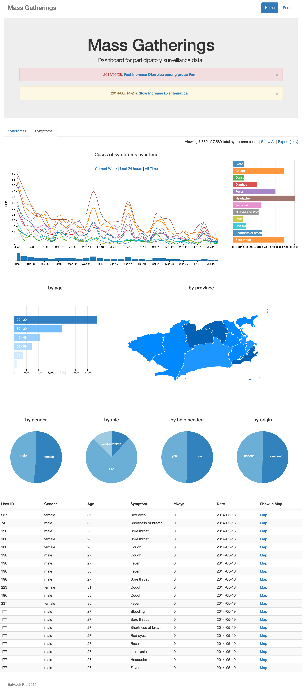

# mgviz

Prototype of analysis and visualization platform for Participatory Surveillance in Mass Gatherings from EpiHack Rio 2015 using dc.js.

Live version available [here](https://spalladino.github.io/mgviz-dc).



## Build & development

```
npm install -g grunt-cli bower
npm install
bower install
grunt serve
```

## Team

### Developers

* Greg Denehy
* Eyvind Niklasson
* James Knox
* David Murphy
* Rodrigo Carneiro
* Santiago Palladino

### Health experts

* Philip Abdelmalik
* Oswaldo Cruz
* Manickam Ponnaiah
* Dan Todkill
* Thomas Mollet
* Anna Karpushkina
* Jennifer Olsen

## License

[MIT](http://opensource.org/licenses/MIT)
